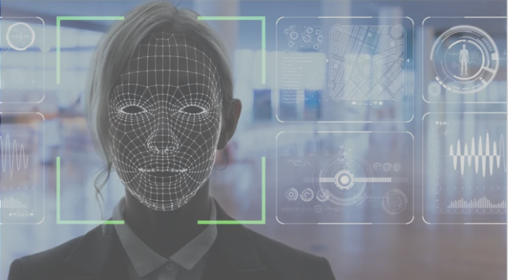

## Measuring Embedded Human-like Biases in Face Recognition Models
 

<!--    -->
  
  

<strong>Information</strong>
<light> 
    🔸 Authors: SangEun Lee**, Soyoung Oh**, Minji Kim, Eunil Park* 
    &nbsp;&nbsp;&nbsp;&nbsp;&nbsp;🔸 ** = equally contributed, * = corresponding author 
    🔸 Published at Proceedings of the 2022 Artificial Intelligence with Biased or Scarce Data Workshop (AIBSD '22). AAAI. 
    🔸 Time period: 2020.09~2021.12 
    🔸 #face recognition #computer vision #ML bias  
    <a href="https://www.mdpi.com/2813-0324/3/1/2">
        🔸 Paper
    </a>
    <a href="https://github.com/sange1104/face-embedding-association-test">
        🔸 Github
    </a>
</light> 
  

<strong>Presentation slide</strong>

    <iframe src="../assets/slide/SocialBias.pdf" scrolling="no" allowfullscreen>
    </iframe>

 
 

<strong>References</strong> 
<light> 
Image: <a href="https://interestingengineering.com/innovation/ai-facial-recognition-and-ip-surveillance-for-smart-retail-banking-and-the-enterprise">https://interestingengineering.com/innovation/ai-facial-recognition-and-ip-surveillance-for-smart-retail-banking-and-the-enterprise</a> 
</light> 
 

<!-- <strong>Background</strong> 

<!-- 이 연구를 왜 시작하게 되었는가

----

Contribution
 

이 연구가 의미있는 부분

----
 

Method & Results
 

FEAT 수식 설명 + 4개의 RQ + 결과 간략 설명

----

What I have learned is...
  

내가 이 연구를 통해서 배운 점

----

  

> **Presentation Slides**

  

 
내용내용내용

  

 -->